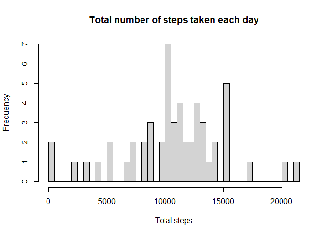
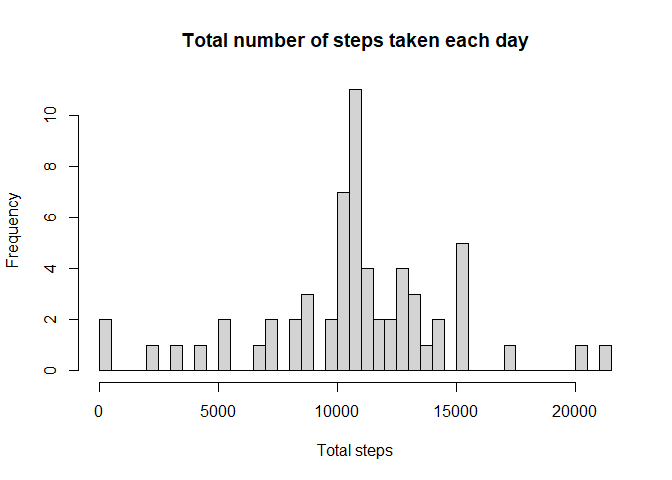
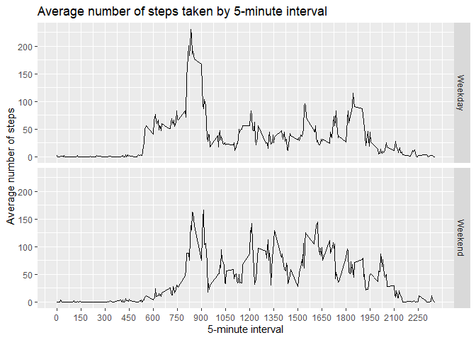

## Loading and preprocessing the data

Code for reading in the dataset and/or processing the data


```r
zip_file <- "Activity.zip"

# Checking if archieve already exists.
if(!file.exists(zip_file)){
    file_url <- "https://d396qusza40orc.cloudfront.net/repdata%2Fdata%2Factivity.zip"
    download.file(file_url, zip_file, method="curl")
} 

# Checking if folder exists
if(!file.exists("./")) { 
    unzip(zip_file) 
}

# read data from activity.csv into activity_df data frame
activity_df <- read.csv("activity.csv")  
```

## What is mean total number of steps taken per day?

For this part of the assignment, you can ignore the missing values in the dataset.

1. Calculate the total number of steps taken per day


```r
tot_steps_a_day <- tapply(activity_df$steps, activity_df$date, sum)
tot_steps_a_day
```

```
## 2012-10-01 2012-10-02 2012-10-03 2012-10-04 2012-10-05 2012-10-06 2012-10-07 
##         NA        126      11352      12116      13294      15420      11015 
## 2012-10-08 2012-10-09 2012-10-10 2012-10-11 2012-10-12 2012-10-13 2012-10-14 
##         NA      12811       9900      10304      17382      12426      15098 
## 2012-10-15 2012-10-16 2012-10-17 2012-10-18 2012-10-19 2012-10-20 2012-10-21 
##      10139      15084      13452      10056      11829      10395       8821 
## 2012-10-22 2012-10-23 2012-10-24 2012-10-25 2012-10-26 2012-10-27 2012-10-28 
##      13460       8918       8355       2492       6778      10119      11458 
## 2012-10-29 2012-10-30 2012-10-31 2012-11-01 2012-11-02 2012-11-03 2012-11-04 
##       5018       9819      15414         NA      10600      10571         NA 
## 2012-11-05 2012-11-06 2012-11-07 2012-11-08 2012-11-09 2012-11-10 2012-11-11 
##      10439       8334      12883       3219         NA         NA      12608 
## 2012-11-12 2012-11-13 2012-11-14 2012-11-15 2012-11-16 2012-11-17 2012-11-18 
##      10765       7336         NA         41       5441      14339      15110 
## 2012-11-19 2012-11-20 2012-11-21 2012-11-22 2012-11-23 2012-11-24 2012-11-25 
##       8841       4472      12787      20427      21194      14478      11834 
## 2012-11-26 2012-11-27 2012-11-28 2012-11-29 2012-11-30 
##      11162      13646      10183       7047         NA
```

2. If you do not understand the difference between a histogram and a barplot, research the difference between them. Make a histogram of the total number of steps taken each day


```r
hist(tot_steps_a_day, breaks = length(tot_steps_a_day), main = "Total number of steps taken each day", xlab = "Total steps")
```

<!-- -->

3. Calculate and report the mean and median of the total number of steps taken per day


```r
calc <- summary(tot_steps_a_day)

print(paste("Mean:", round(calc["Mean"],0)))
```

```
## [1] "Mean: 10766"
```

```r
print(paste("Median:", round(calc["Median"],0)))
```

```
## [1] "Median: 10765"
```

## What is the average daily activity pattern?

1. Make a time series plot (i.e. type = "l") of the 5-minute interval (x-axis) and the average number of steps taken, averaged across all days (y-axis)


```r
mean_steps_a_day <- tapply(activity_df$steps, activity_df$interval, mean, na.rm = TRUE)

plot(names(mean_steps_a_day), mean_steps_a_day, xlab = "5-minute interval", ylab = "Average number of steps", type = "l")
```

<!-- -->

2. Which 5-minute interval, on average across all the days in the dataset, contains the maximum number of steps?


```r
maxnum <- which.max(mean_steps_a_day)
print(paste("5-minute interval contaians maximum number of steps:", names(maxnum)))
```

```
## [1] "5-minute interval contaians maximum number of steps: 835"
```

## Imputing missing values

Note that there are a number of days/intervals where there are missing values (coded as NA). The presence of missing days may introduce bias into some calculations or summaries of the data.

1. Calculate and report the total number of missing values in the dataset (i.e. the total number of rows with NAs)


```r
missing_val <- is.na(activity_df$steps)
tot_missing <- length(missing_val[missing_val==TRUE])
print(paste("Total number of rows with NAs:", tot_missing))
```

```
## [1] "Total number of rows with NAs: 2304"
```

2. Devise a strategy for filling in all of the missing values in the dataset. The strategy does not need to be sophisticated. For example, you could use the mean/median for that day, or the mean for that 
5-minute interval, etc.


```r
mean_steps_df <- data.frame(cbind(mean_steps_a_day))
colnames(mean_steps_df) <- "mean.steps"
head(mean_steps_df)
```

```
##    mean.steps
## 0   1.7169811
## 5   0.3396226
## 10  0.1320755
## 15  0.1509434
## 20  0.0754717
## 25  2.0943396
```

3. Create a new dataset that is equal to the original dataset but with the missing data filled in.


```r
new_dataset <- activity_df

new_dataset$steps <- ifelse(is.na(new_dataset$steps), mean_steps_df$mean.steps, new_dataset$steps)
head(new_dataset)
```

```
##       steps       date interval
## 1 1.7169811 2012-10-01        0
## 2 0.3396226 2012-10-01        5
## 3 0.1320755 2012-10-01       10
## 4 0.1509434 2012-10-01       15
## 5 0.0754717 2012-10-01       20
## 6 2.0943396 2012-10-01       25
```

4. Make a histogram of the total number of steps taken each day and Calculate and report the mean and median total number of steps taken per day. Do these values differ from the estimates from the first part of the assignment? What is the impact of imputing missing data on the estimates of the total daily number of steps?


```r
tot_steps_a_day <- tapply(new_dataset$steps, new_dataset$date, sum)
hist(tot_steps_a_day, breaks = length(tot_steps_a_day), main = "Total number of steps taken each day", xlab = "Total steps")
```

<!-- -->

```r
calc <- summary(tot_steps_a_day)

print(paste("Mean:", round(calc["Mean"],0)))
```

```
## [1] "Mean: 10766"
```

```r
print(paste("Median:", round(calc["Median"],0)))
```

```
## [1] "Median: 10766"
```

After imputing missing data, the frequency of total 10,000 steps is higher compare to the first part of the assignment. However the Mean and Median are almost the same.

## Are there differences in activity patterns between weekdays and weekends?

For this part the weekdays() function may be of some help here. Use the dataset with the filled-in missing values for this part.

1. Create a new factor variable in the dataset with two levels – “weekday” and “weekend” indicating whether a given date is a weekday or weekend day.


```r
new_dataset$date <- strptime(new_dataset$date, "%Y-%m-%d")
new_dataset$factor <- ifelse((weekdays(new_dataset$date) %in% c("Monday", "Tuesday","Wednesday","Thursday","Friday")), "Weekday","Weekend")

head(new_dataset)
```

```
##       steps       date interval  factor
## 1 1.7169811 2012-10-01        0 Weekday
## 2 0.3396226 2012-10-01        5 Weekday
## 3 0.1320755 2012-10-01       10 Weekday
## 4 0.1509434 2012-10-01       15 Weekday
## 5 0.0754717 2012-10-01       20 Weekday
## 6 2.0943396 2012-10-01       25 Weekday
```

2. Make a panel plot containing a time series plot (i.e. type = "l") of the 5-minute interval (x-axis) and the average number of steps taken, averaged across all weekday days or weekend days (y-axis). See the README file in the GitHub repository to see an example of what this plot should look like using simulated data.


```r
library(ggplot2)
library(dplyr)
```

```
## Warning: package 'dplyr' was built under R version 4.0.2
```

```
## 
## Attaching package: 'dplyr'
```

```
## The following objects are masked from 'package:stats':
## 
##     filter, lag
```

```
## The following objects are masked from 'package:base':
## 
##     intersect, setdiff, setequal, union
```

```r
by_interval_factor <- new_dataset %>% group_by(interval, factor) %>% summarise(avg_steps = mean(steps, na.rm = TRUE))
```

```
## `summarise()` regrouping output by 'interval' (override with `.groups` argument)
```

```r
g <- ggplot(data = by_interval_factor, mapping = aes(x = interval, 
  y = avg_steps)) + geom_line() + facet_grid(factor ~ .) +
  scale_x_continuous("5-minute interval",                             breaks = seq(min(by_interval_factor$interval),
  max(by_interval_factor$interval), 150)) + 
  scale_y_continuous("Average number of steps") + 
  ggtitle("Average number of steps taken by 5-minute interval")
g
```

<!-- -->

The average steps on Weekday at interval 825 is higher than weekend, however subsequently the average steps on weekend increase at interval between 1200 and 1650. More activities are happening within this interval compare to weekday.
